# 💀 🎣 Cybersecurity desafio phishing 🎣 💀

Desafio do Santander Bootcamp Cibersegurança utilizando aplicaç˜a de engenharia social com t´ecnicas de phishing.

Agradeço ao amigo Percio Andrade que ajudou na parte 'Corrigir c´odigo da p´agina index.html'
https://web.dio.me/users/perciocastelo

## Ferramentas ⚙️
- Kali Linux
- setoolkit

## Etapas do desafio ⌨️

Acesso root : ˋ sudo su ˋ

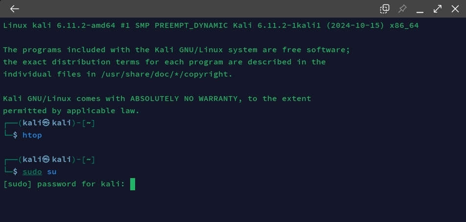

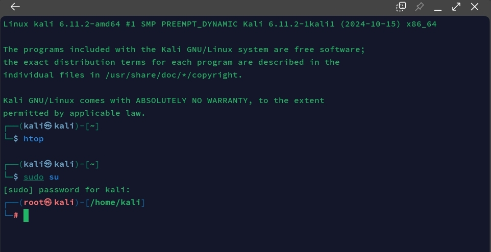

Obtendo o endereço IP do Kali Linux: ˋip aˋ ou ˋifconfigˋ

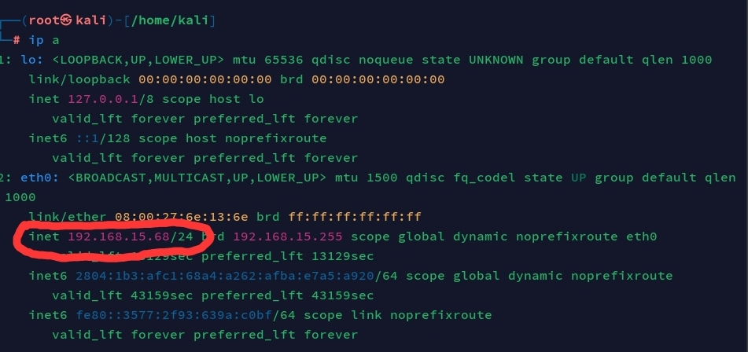

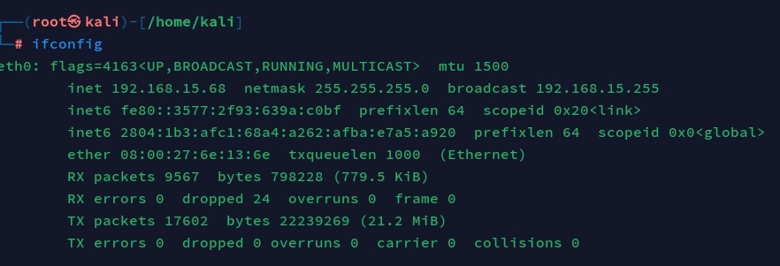

Iniciando o setoolkit: ˋsetoolkitˋ

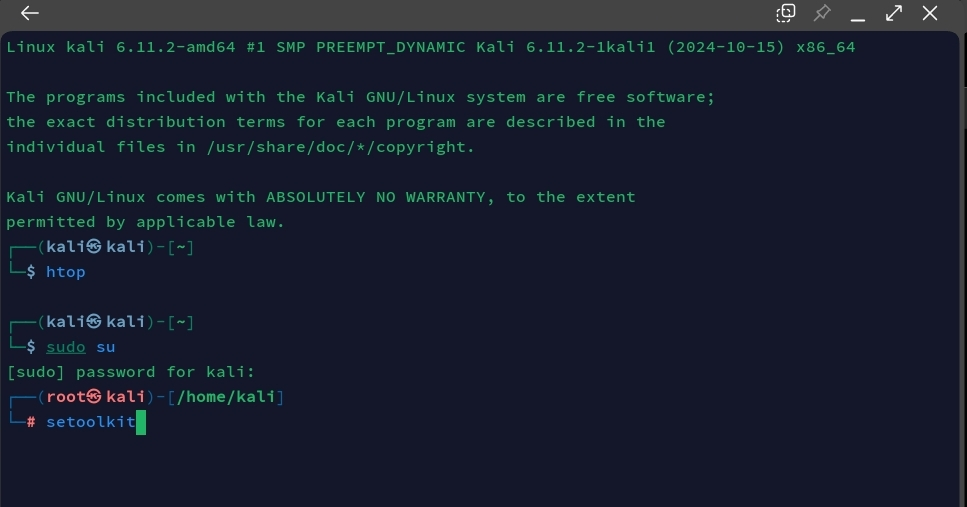

Tipo de ataque: Social-Engineering Attacks (opção 1)

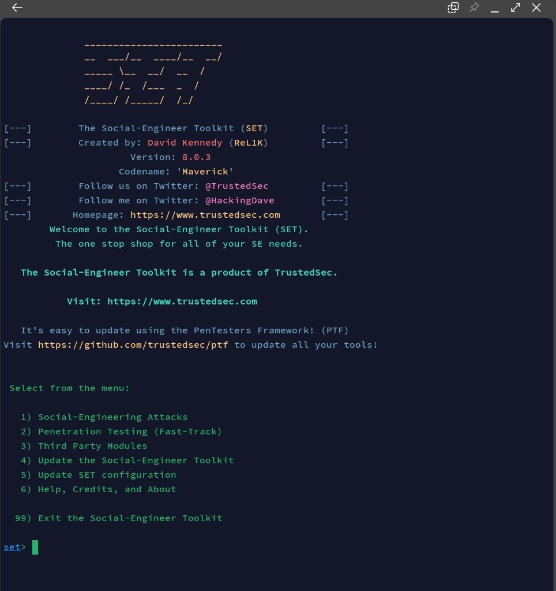

Vetor de ataque: Web Site Attack Vectors (opção 2)

Método de ataque: Credencial Harvester Attack Method (opção 3)

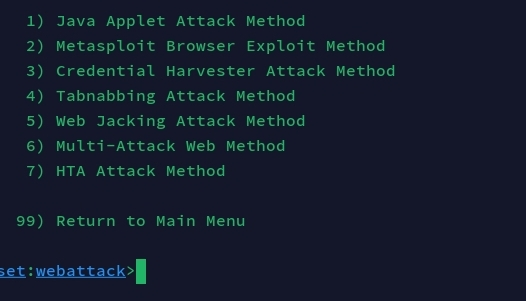

Método de ataque: Site Cloner (opção 2)

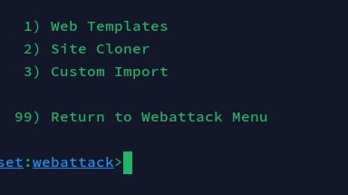

Selecionar a opção padrão para o endereço IP do servidor web do setoolkit

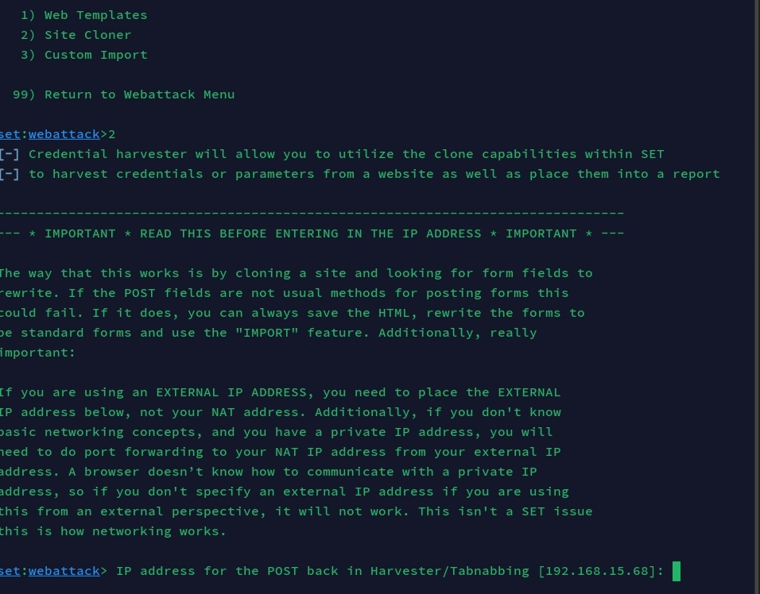

URL para clone: http://www.facebook.com

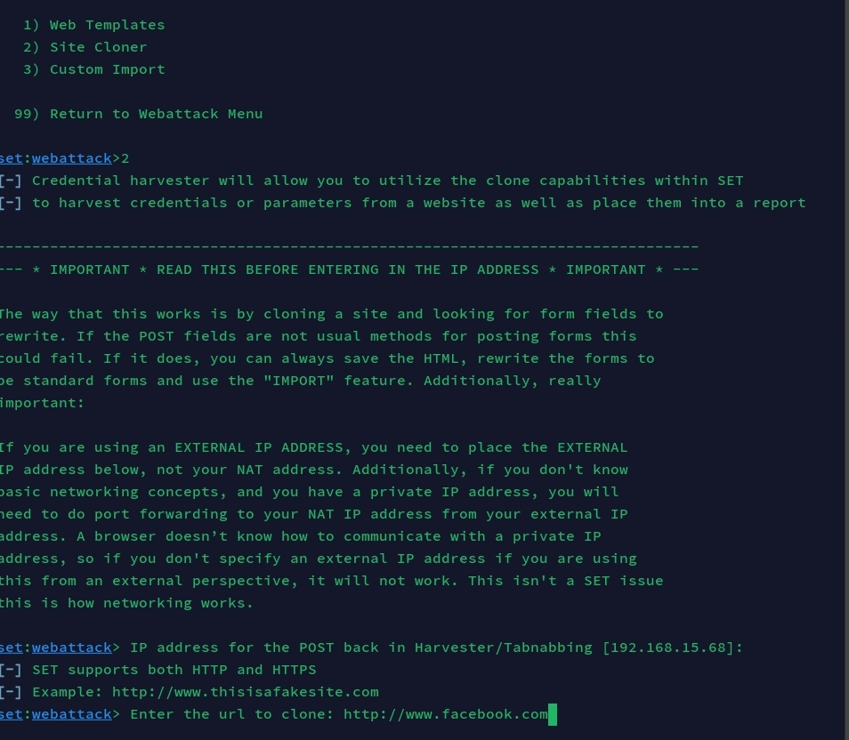

Inserir usuário e senha e logar. Nada acontece
Log do setoolkit nao exibe possivel usuário e senha

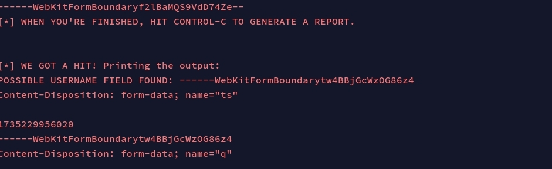

## Corrigir código da página index.html 🛠️

Ir até o diretório onde o setoolkit armazena o index.html da página clonada: ˋcd /root/.set/web_clone/index.htmlˋ

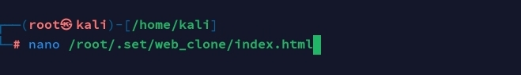

Remover a linha do código html onde o script é chamado:

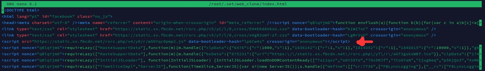

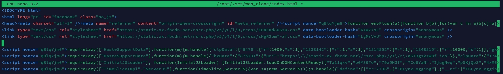

Ir para a página do facebook na máquina da vitima

Inserir usuário, senha e logar novamente. Note que agora houve um redirecionamento para a página verdadeira do facebook.
Caso uma conta legitima estivesse logada no navegador, esse redirecionamento iria abrir a tela dessa conta.

!(images/Screenshot_20241226_131818_Microsoft_Remote_Desktop.jpg)

Checar nos logs do setoolkit o usuário e senha digitados pela vitima.
Note que agora o usuário e senha inserido aparecem em texto claro no terminal do Kali.

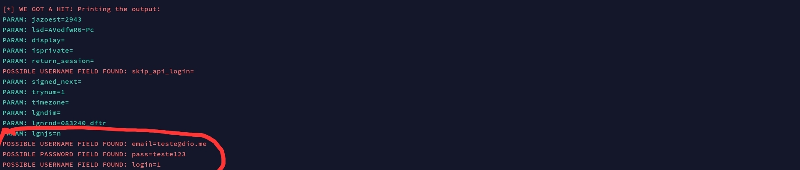

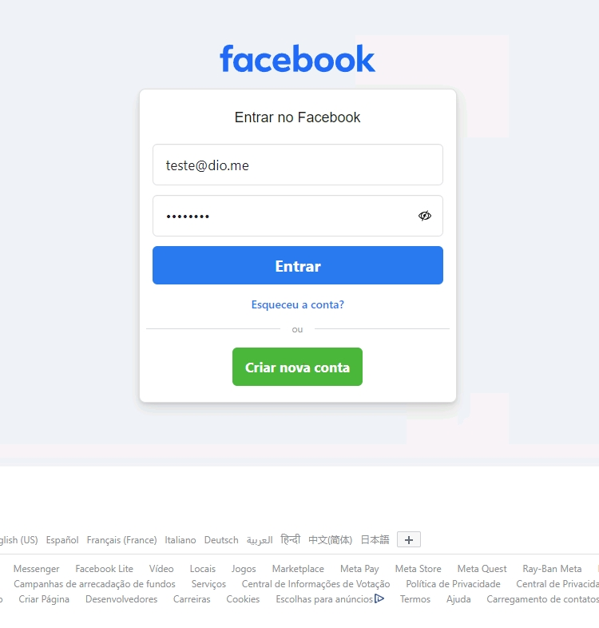

Checar nos logs do setoolkit o usuário e senha digitados pela vitima.
Note que agora o usuário e senha inserido aparecem em texto claro no terminal do Kali.

